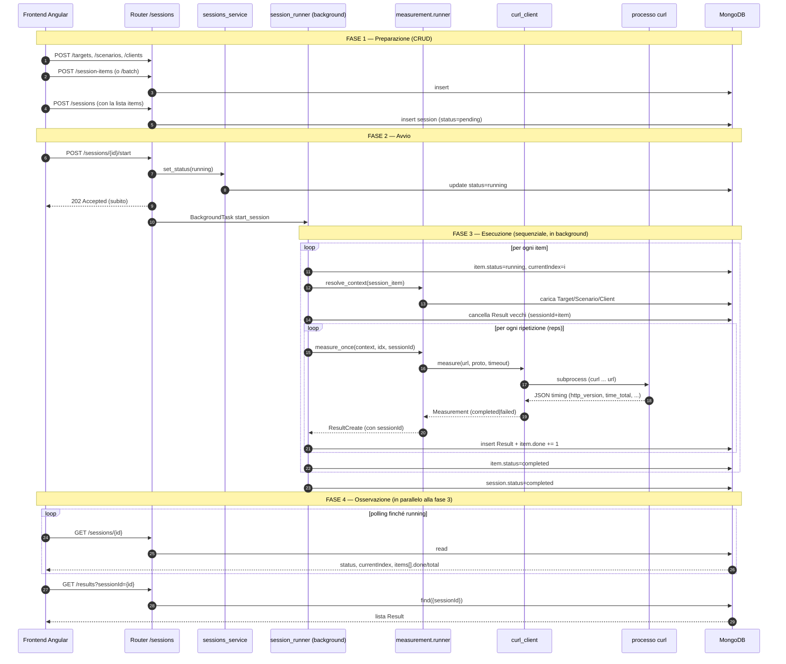

# Documentazione tecnica del backend QNQ

> Documento di riferimento per lavorare sul codice e per la discussione di tesi.
> Complementare ad `AGENTS.md`: quello è il *contratto* (modello dati e
> convenzioni), questo è la *spiegazione ragionata* dell'architettura e delle
> scelte. Dove serve, i due si rimandano a vicenda.

Indice:

1. [Panoramica generale](#1-panoramica-generale)
2. [Architettura a livelli](#2-architettura-a-livelli)
3. [I service, uno per uno](#3-i-service-uno-per-uno)
4. [Pattern architetturali usati e perché](#4-pattern-architetturali-usati-e-perché)
5. [Decisioni tecniche non ovvie](#5-decisioni-tecniche-non-ovvie)
6. [Come estendere il sistema](#6-come-estendere-il-sistema)

---

## 1. Panoramica generale

### Cosa fa

Questo backend è il **motore di orchestrazione di un banco di prova** che
confronta le prestazioni di **HTTP/2 contro HTTP/3** su uno o più server web.
Non è il server sotto test e non è l'interfaccia utente: è il componente che
*decide cosa misurare, esegue le misure e conserva i risultati*.

Concretamente permette di:

- catalogare i **server da testare** (`Target`), i **percorsi da richiedere**
  (`Scenario`) e gli **agenti di misura** (`Client`);
- comporre **unità di lavoro** (`SessionItem` = "misura *questo* scenario su
  *questo* target, N volte");
- raggruppare più unità in una **sessione** (`Session`) ed **eseguirla**;
- salvare l'esito di ogni singola ripetizione (`Result`) con i tempi rilevati.

La misura vera e propria è delegata a un **binario `curl`** compilato con
supporto sia HTTP/2 sia HTTP/3, invocato come processo esterno.

### Dove si colloca nell'ecosistema

```
┌──────────────────┐   HTTP/JSON    ┌──────────────────────┐   subprocess    ┌───────────────────┐
│  Frontend        │  ───────────▶  │  Backend QNQ         │  ────curl────▶  │  Server sotto     │
│  Angular         │  ◀───────────  │  (questo progetto)   │  ◀───timing───  │  test (milaz.it)  │
│  localhost:4200  │                │  FastAPI + MongoDB   │                 │  HTTP/2 + HTTP/3   │
└──────────────────┘                └──────────┬───────────┘                 └───────────────────┘
                                               │ motor (async)
                                               ▼
                                        ┌──────────────┐
                                        │  MongoDB     │
                                        │  (standalone)│
                                        └──────────────┘
```

- **Frontend Angular** (`http://localhost:4200`): consuma l'API REST. Crea le
  entità, avvia le sessioni e fa **polling** su una sessione in esecuzione per
  mostrarne l'avanzamento in tempo reale.
- **Backend QNQ** (questo repository): espone l'API REST con **FastAPI**,
  persiste su **MongoDB** tramite il driver asincrono **`motor`**, e lancia
  `curl` per eseguire le misure.
- **Server sotto test**: i server web reali di cui si misurano le prestazioni
  (nell'ambiente di tesi, tre stack — Caddy, OpenLiteSpeed, nginx — su
  `milaz.it`, ciascuno esposto sia in HTTP/2 sia in HTTP/3).

### Stack tecnologico

| Componente     | Scelta                                    | Ruolo |
| -------------- | ----------------------------------------- | ----- |
| Linguaggio     | Python 3.11+                              | — |
| Web framework  | FastAPI                                   | routing, validazione, OpenAPI |
| ASGI server    | Uvicorn                                   | esecuzione dell'app |
| Database       | MongoDB (standalone)                      | persistenza documentale |
| Driver DB      | `motor` (`AsyncIOMotorClient`)            | accesso async a Mongo |
| Validazione    | Pydantic v2                               | modelli e contratto dati |
| Config         | `pydantic-settings` + `.env`              | configurazione per ambiente |
| Misura         | binario `curl` custom (HTTP/2 + HTTP/3)   | esecuzione delle richieste |

Il fatto che *tutto* — DB e rete — sia asincrono (`async def`) non è un
dettaglio estetico: durante una sessione il backend passa la maggior parte del
tempo in attesa (di `curl`, di Mongo). L'async permette all'event loop di
restare reattivo (es. rispondere al polling del frontend) mentre una misura è in
corso.

---

## 2. Architettura a livelli

Il codice è organizzato in **tre strati con una direzione di dipendenza unica**:

```
        HTTP  ┌──────────────────────────────────────────────┐
   richiesta  │  ROUTERS  (app/routers/)                      │  parla "HTTP"
     ────────▶│  • validano input / serializzano output       │  conosce FastAPI
              │  • NON toccano MongoDB                         │
              └───────────────────┬──────────────────────────┘
                                  │ chiama
                                  ▼
              ┌──────────────────────────────────────────────┐
              │  SERVICES  (app/services/)                    │  parla "dominio"
              │  • logica di business                         │  NON conosce FastAPI
              │  • sollevano AppError (non HTTPException)      │
              └───────────────────┬──────────────────────────┘
                                  │ usa
                                  ▼
              ┌──────────────────────────────────────────────┐
              │  DB LAYER  (app/db/)                          │  parla "Mongo"
              │  • espone AsyncIOMotorDatabase / collezioni   │  nessuna logica
              └──────────────────────────────────────────────┘
```

Regola sintetica: **`routers → services → db`**, mai al contrario, mai
saltando uno strato.

### Cosa fa ciascuno strato

- **Router** (`app/routers/`): l'unico strato che conosce FastAPI. Riceve la
  richiesta HTTP, ne fa validare il corpo da Pydantic, chiama *un* service,
  mappa il risultato in risposta HTTP con lo `status_code` giusto (`200`/`201`/
  `204`). Non contiene `try/except` per errori di dominio e **non importa nulla
  da `motor`/`pymongo`**.
- **Service** (`app/services/`): la logica di business. Converte gli id, compone
  le query, applica le regole del dominio, solleva le eccezioni applicative
  (`AppError` e sottoclassi). **Non importa nulla da `fastapi`**: un service non
  sa cosa sia una richiesta HTTP, e questo lo rende testabile e riutilizzabile
  (potrebbe essere chiamato da uno script, da un task schedulato, ecc.).
- **DB layer** (`app/db/`): il ciclo di vita della connessione (`mongo.py`), i
  nomi delle collezioni centralizzati (`collections.py`) e l'accesso alle
  collezioni (`get_collection`). Nessuna regola di dominio.

### Perché questa separazione

1. **Sostituibilità.** Il frontend dialoga solo con i router; i router
   dialogano solo con i service; i service solo con il db. Cambiare il web
   framework toccherebbe solo i router; cambiare il database toccherebbe solo il
   db layer e le query nei service. Ogni confine è un punto in cui si può
   intervenire senza propagare il cambiamento all'intero sistema.
2. **Testabilità.** Poiché i service non dipendono da FastAPI, si possono
   testare invocandoli come normali funzioni `async`, senza montare un server
   HTTP. È così che ho verificato le misure in questa sessione: chiamando
   direttamente `curl_client.measure(...)`.
3. **Un solo posto per ogni responsabilità.** La forma delle risposte di errore
   sta negli handler centralizzati; la costruzione del comando `curl` sta in un
   solo file; i nomi delle collezioni in un solo modulo. Niente logica duplicata
   che diverge nel tempo.

### Cosa succederebbe senza gli strati

Se i router parlassero direttamente con Mongo (l'anti-pattern del "fat
controller"):

- ogni endpoint reinventerebbe la conversione `id`→`ObjectId`, la gestione di
  "documento non trovato", il wrapping degli errori di pymongo → codice
  duplicato che diverge;
- la logica di business finirebbe *dentro* le funzioni HTTP, impossibile da
  richiamare fuori da una richiesta (es. il `session_runner`, che gira in
  background, non avrebbe da chi farsi eseguire le operazioni);
- un cambio di database costringerebbe a toccare decine di endpoint invece di un
  solo strato.

La stratificazione ha un costo (un po' di "passacarte" nei router), ripagato
dalla località dei cambiamenti.

---

## 3. I service, uno per uno

### 3.1 I quattro service CRUD: `targets`, `scenarios`, `clients`, `session_items`

Questi quattro service sono **volutamente quasi identici**: gestiscono entità
"semplici" (senza comportamento, solo dati) e implementano tutti lo stesso
schema CRUD. Prendendo `targets_service` come modello, ciascuno espone:

| Funzione            | Operazione Mongo               | Note |
| ------------------- | ------------------------------ | ---- |
| `list_xxx()`        | `find().sort(...)`             | legge tutti, converte in modello |
| `get_xxx(id)`       | `find_one({"_id": oid})`       | `NotFoundError` se assente |
| `create_xxx(p)`     | `insert_one(...)`              | ricostruisce il modello con l'`_id` generato |
| `update_xxx(id, p)` | `find_one_and_update` + `$set` | solo i campi presenti; `422` se payload vuoto |
| `delete_xxx(id)`    | `delete_one(...)`              | `NotFoundError` se non cancellava nulla |

Il **pattern comune** che si ripete in ogni funzione:

```python
# SCRITTURA: dal modello Pydantic al documento Mongo
document = payload.model_dump(by_alias=True, mode="json")
#   by_alias=True  → usa i nomi JSON (camelCase: targetId, ...)
#   mode="json"    → tipi serializzabili (datetime→str, MongoId→str)

# LETTURA: dal documento Mongo al modello Pydantic
return Target.model_validate(document)
#   il BeforeValidator su MongoId converte _id (ObjectId) → stringa

# CONVERSIONE ID: stringa dall'URL → ObjectId per la query
object_id = to_object_id(target_id, "Id del target")
#   se la stringa non è un ObjectId valido → ValidationError (422), non 500

# ERRORI DB: ogni operazione pymongo è avvolta
try:
    ...
except PyMongoError as exc:
    raise DatabaseError("...") from exc   # → 503, mai un 500 opaco
```

Due dettagli non ovvi ma deliberati:

- **Dopo l'`insert_one` il modello viene ricostruito in memoria**
  (`model_validate({**document, "_id": inserted_id})`) invece di rileggere il
  documento dal database: si risparmia un round-trip e si restituisce
  esattamente ciò che si è scritto.
- **`update` usa `exclude_unset=True`**: un campo non inviato dal client resta
  invariato (`$set` mirato), un campo inviato a `null` lo azzera. È la semantica
  PATCH-like descritta dal modello `XxxUpdate`.

**Perché sono così simili?** Perché le loro entità *sono* simili: contenitori di
dati validati, senza logica. La ripetizione è il prezzo della chiarezza —
ciascun service è leggibile in isolamento, senza dover capire un'astrazione
condivisa. La checklist in `AGENTS.md` §7 codifica esattamente questo pattern
per aggiungere una nuova entità.

`session_items_service` aggiunge una sola funzione oltre al CRUD:
**`create_session_items_batch(payloads)`** (`insert_many`), pensata per il
wizard del frontend che genera in un colpo solo il prodotto cartesiano
*Target × Scenario*. Solleva `ValidationError` su lista vuota, senza toccare il
database.

### 3.2 `sessions_service` — creazione, avvio, cancellazione a cascata

La `Session` non è un semplice contenitore: rappresenta **un'esecuzione**, e
quindi ha uno stato che evolve (`pending → running → completed`) e una lista
`items` di avanzamento embedded (`SessionProgressItem`).

Oltre al CRUD, il service espone funzioni usate **dal `session_runner` durante
l'esecuzione in background** per aggiornare lo stato in modo mirato:

- `set_status(id, status)` — cambia lo stato complessivo;
- `set_current_index(id, i)` — segna quale item è in corso;
- `update_item_progress(id, i, done=, total=, status=)` — aggiorna un singolo
  item con la **notazione posizionale** `items.<i>.<campo>`, **senza riscrivere
  l'intero array**. È un dettaglio importante: aggiornamenti mirati restano
  atomici e non sovrascrivono il lavoro già fatto sugli altri item; è ciò che
  permette al polling del frontend di vedere `done` salire ripetizione per
  ripetizione.

#### La cancellazione a cascata e il perché di `sessionId`

`delete_session(id)` non elimina solo la sessione: elimina **anche tutti i suoi
`Result`**. Qui c'è la decisione di modellazione più importante del progetto.

**Il problema.** Un `Result` va legato all'esecuzione che l'ha prodotto. La
tentazione è usare `sessionItemId`, che il `Result` già contiene. Ma **lo stesso
`SessionItem` può essere condiviso da più sessioni**: un rilancio o una
riproposizione riusano la stessa configurazione. Cancellare i `Result` per
`sessionItemId` cancellerebbe anche le misure di *altre* sessioni ancora
esistenti che condividono quel `SessionItem`.

**La soluzione.** Il `Result` porta **due** riferimenti distinti (vedi
`AGENTS.md` §3.3):

- `sessionItemId` → *quale configurazione* (target + scenario) ha prodotto la
  misura;
- `sessionId` → *quale esecuzione* l'ha prodotta.

Solo `sessionId` identifica senza ambiguità i risultati di una singola sessione.
`delete_session` filtra quindi per `sessionId`.

**Coerenza senza transazioni.** Il MongoDB in uso è **standalone**, e le
transazioni multi-documento richiedono un replica set (verificato: falliscono
con *"Transaction numbers are only allowed on a replica set member or mongos"*).
La coerenza è quindi garantita dall'**ordine delle operazioni**, non da una
transazione:

1. prima `delete_many` dei `Result` con quel `sessionId`;
2. poi `delete_one` della sessione (→ `404 NOT_FOUND` se non esisteva).

I risultati sono cancellati **prima** di proposito: se il passo 2 fallisce, la
sessione resta e l'operazione è **ripetibile**; l'ordine inverso lascerebbe
`Result` orfani non più raggiungibili. Nel caso normale di sessione inesistente
non esistono risultati con quel `sessionId`, quindi il passo 1 è un no-op e il
`404` viene sollevato correttamente dal passo 2.

### 3.3 `results_service` — sola lettura via API, scrittura interna

I `Result` non sono creati dal client HTTP: nascono **solo** dall'esecuzione di
una sessione. Perciò l'API espone solo la lettura; `create_result` è usata
internamente dal runner. Le funzioni:

- **`list_results(scenario_path=, session_item_ids=, session_id=)`** — elenca i
  risultati filtrati (filtri in **AND**, ordinati per istante di completamento).
  I tre filtri sono opzionali; una lista di id vuota vale "nessun filtro", non
  "nessun risultato".
- **`create_result(payload)`** — inserisce un `Result` (chiamata dal runner).
- **`delete_results_by_session(session_id)`** — cancellazione a cascata (§3.2).
- **`delete_results_by_session_and_item(session_id, session_item_id)`** —
  pulizia pre-run: cancella i risultati di *questa stessa sessione* per un item
  prima di rieseguirlo, così un rilancio non accumula duplicati.

#### Perché `sessionId` ha sostituito il vecchio filtro ambiguo

In lettura, `GET /api/results` accetta oggi **due** filtri per esecuzione:

- `?sessionId=` — il filtro **preferito**: diretto, senza ambiguità, restituisce
  esattamente i risultati di *una* esecuzione;
- `?sessionItemIds=` — lista comma-separated, mantenuto per compatibilità ma
  **ambiguo** per lo stesso motivo visto in §3.2 (un `SessionItem` condiviso fa
  sì che il filtro raccolga risultati di sessioni diverse).

Anche la **pulizia pre-run** ha subìto la stessa correzione: prima cancellava
per solo `sessionItemId` (e quindi un rilancio distruggeva i risultati di altre
sessioni che riusavano quell'item), ora usa `sessionId + sessionItemId`.

### 3.4 `measurement/curl_client.py` — parlare con il processo `curl`

È l'**unico** punto del sistema che conosce la riga di comando di `curl`. La sua
responsabilità è tradurre "misura questo URL con questo protocollo" in un
processo esterno e riportarne l'esito in un oggetto di dominio
(`Measurement`). È diviso in tre momenti.

**1. Costruzione del comando (`build_command`).**

```
<curl> -s -S -o /dev/null (--http2|--http3) --max-time <t> -w <json> --no-keepalive [--cacert <ca>] <url>
```

- `-o /dev/null` — scarta il corpo, per non falsare i tempi con la scrittura su
  disco;
- `--http2` / `--http3` — chiede il protocollo (non è vincolante, vedi §5);
- `-w <json>` — chiede a `curl` di stampare una riga JSON con `http_version`,
  `response_code`, `time_total`, `time_starttransfer`, `size_download`;
- `--no-keepalive` — **sempre presente**, per rendere esplicito che ogni misura
  è "a freddo" (vedi §5);
- `--cacert <ca>` — aggiunto **solo se** configurato, per validare certificati
  self-signed (vedi §5);
- gli argomenti sono passati come **lista**, mai come stringa di shell: host e
  path vengono dal database e non devono poter essere interpretati come comandi
  (niente shell injection).

**2. Esecuzione (`measure`).** Lancia `curl` come sottoprocesso asincrono
(`asyncio.create_subprocess_exec`, **senza shell**) e ne attende l'esito con un
timeout *più generoso* di `--max-time` (margine `CURL_KILL_GRACE_MS`): il
margine lascia a `curl` la possibilità di terminare da solo e riportare
l'errore; se il processo si blocca comunque, viene **ucciso e atteso**, per non
lasciare zombie né bloccare l'intera sessione. Ogni tipo di fallimento (binario
assente, errore di avvio, exit code ≠ 0, output non-JSON, timeout) è tradotto in
un `Measurement` fallito tramite `_failed(...)`: **`measure` non solleva mai
eccezioni di rete**, così il chiamante può sempre salvare un `Result`.

**3. Interpretazione dell'output (`_to_measurement`).** Qui sta la regola
centrale sulla validità della misura:

```
http_version = "2"  → Protocol.HTTP2   → misura VALIDA   → status completed
http_version = "3"  → Protocol.HTTP3   → misura VALIDA   → status completed
http_version = "1.1"/"1.0"/altro       → misura NON valida → status failed
response_code == 0  (nessuna risposta) → misura NON valida → status failed
```

- `curl` riporta i tempi in **secondi** e la dimensione in **byte**; qui vengono
  convertiti nelle unità del modello `Result` (**millisecondi** e **kilobyte**).
- Su **successo**, `actual_proto` è valorizzato (`HTTP/2` o `HTTP/3`) — può
  differire dal richiesto in caso di fallback *fra i due* (che resta valido).
- Su **fallimento**, `actual_proto` è `None` e tempi/byte sono azzerati: un
  fallback su HTTP/1.1 non è una misura del protocollo richiesto, quindi i suoi
  numeri non devono poter essere scambiati per dati validi da chi legge solo
  `total`/`ttfb` senza controllare `status` (vedi §5).

### 3.5 `measurement/runner.py` — dal dominio alla misura concreta

Se `curl_client` parla con il *processo*, `runner` parla con il *dominio*: fa da
ponte fra le entità (`Target`/`Scenario`/`Client`) e una misura eseguibile. Due
funzioni:

- **`resolve_context(session_item)`** → `MeasurementContext`. Carica dal
  database il `Target`, lo `Scenario` e il `Client` referenziati dal
  `SessionItem` (un riferimento rotto → `NotFoundError`), **verifica che il
  client sia `curl`** (qualunque altro → `NotImplementedFeatureError`, HTTP
  `501`) e compone l'URL `https://host:port/path`. La risoluzione avviene **una
  sola volta per item**, non a ogni ripetizione: l'URL e le entità sono
  costanti per tutte le `reps`, e rifarle N volte sarebbe solo lavoro sprecato.
- **`measure_once(context, idx, session_id)`** → `ResultCreate`. Invoca
  `curl_client.measure`, traduce l'esito nel modello `Result` valorizzando
  `sessionId` (la sessione che sta eseguendo), `proto` (sempre il protocollo
  *richiesto*), `actualProto` (solo su successo) e lo `status`
  (`completed`/`failed`).

Il `MeasurementContext` è un `dataclass(frozen=True)`: un contenitore immutabile
di ciò che serve alle ripetizioni (session_item, target, scenario, url,
target_label), così che il ciclo delle `reps` non debba più toccare il database.

### 3.6 `session_runner.py` — l'orchestrazione sequenziale in background

È il direttore d'orchestra. Quando arriva `POST /api/sessions/{id}/start`, il
router porta la sessione in `running`, risponde **subito** `202` e accoda
`start_session` come **BackgroundTask** di FastAPI: l'esecuzione prosegue dopo
che la risposta è già partita.

Struttura a tre livelli:

- **`start_session(session_id)`** — il guscio robusto. Porta la sessione in
  `running`, esegue gli item, e in un blocco `finally` la porta **sempre** in
  `completed`. Non solleva mai eccezioni verso l'esterno: gira in background,
  dove un'eccezione non gestita lascerebbe la sessione bloccata in `running` per
  sempre. Qualunque errore viene loggato e la sessione viene comunque chiusa.
- **`_run_items(session)`** — il ciclo **sequenziale** sugli item. Per ciascuno:
  aggiorna `currentIndex`, lo porta in `running`, lo esegue, lo chiude in
  `completed`. Se un item fallisce in modo irrecuperabile (riferimento rotto,
  client non supportato) lo chiude invece in `failed` e salva un `Result`
  segnaposto "failed" — così il fallimento resta tracciato e **la sessione
  prosegue con gli altri item** (una configurazione sbagliata su un item non
  invalida l'intera sessione).
- **`_run_single_item(session_id, index, item)`** — le ripetizioni di un singolo
  item. Carica il `SessionItem`, risolve il contesto, **cancella i risultati di
  una precedente run di questa stessa sessione per questo item** (scoping
  `sessionId + sessionItemId`), poi esegue `reps` misure: per ciascuna salva il
  `Result` e **incrementa `done` sul database subito dopo**.

#### Il meccanismo di polling che ne deriva

L'incremento di `done` dopo *ogni* ripetizione non è un dettaglio: è ciò che
rende osservabile l'avanzamento. Il frontend **non** riceve aggiornamenti push;
fa **polling** su `GET /api/sessions/{id}` a intervalli regolari e legge lo
stato corrente (`status`, `currentIndex`, e per ogni item `done`/`total`/
`status`). Poiché il runner scrive questi campi su Mongo man mano, ogni GET
restituisce una fotografia aggiornata e la barra di avanzamento cresce in tempo
reale.

```
Runner (background)                     Frontend (polling ogni ~1s)
──────────────────                      ───────────────────────────
item 0: done=1  ─┐
                 ├─▶  Mongo  ◀── GET /sessions/{id} → items[0].done = 1
item 0: done=2  ─┘
item 0: completed ─▶ Mongo  ◀── GET /sessions/{id} → items[0].completed, item[1].running
...
status: completed ─▶ Mongo  ◀── GET /sessions/{id} → completed → stop polling
```

**Perché sequenziale e non parallelo?** Perché è l'unica cosa che questa
applicazione deve misurare correttamente: due richieste concorrenti si
contenderebbero la banda e falserebbero il confronto fra HTTP/2 e HTTP/3. La
sequenzialità è una **scelta metodologica**, non un limite tecnico (vedi §5).

---

## Diagramma del flusso principale

Dalla creazione di una sessione fino ai risultati:



Versione compatta (ASCII), per una lettura d'insieme:

```
CREAZIONE                AVVIO                 ESECUZIONE (bg, sequenziale)         RISULTATI
─────────                ─────                 ────────────────────────────         ─────────
targets ─┐                                     ┌─ item i: running                   GET /results
scenario ┼─▶ session ──▶ POST .../start ──────▶│    per rep: curl → Result (+done)      ?sessionId=
clients ─┘   (pending)   → 202 + running       │  item i: completed                 → misure valide
session_items                └─ BackgroundTask ─┴─ session: completed                   (status=completed)
                                    ▲                     │
                          GET /sessions/{id}  ◀───────────┘  (polling: done/total live)
```

---

## 4. Pattern architetturali usati e perché

Questa sezione spiega i pattern in modo autonomo, comprensibile anche senza aver
letto il codice riga per riga.

### 4.1 Gestione errori centralizzata (`AppError` + handler)

**Idea.** Invece di formattare le risposte di errore in ogni endpoint, si
definisce una **gerarchia di eccezioni di dominio** e un piccolo insieme di
**handler** che le traducono, tutte, nella stessa forma JSON.

La gerarchia (`app/core/errors.py`):

| Eccezione                    | HTTP | `code`                 | Quando |
| ---------------------------- | ---- | ---------------------- | ------ |
| `NotFoundError`              | 404  | `NOT_FOUND`            | risorsa inesistente |
| `ValidationError`            | 422  | `VALIDATION_ERROR`     | input valido ma non accettabile |
| `ConflictError`              | 409  | `CONFLICT`             | conflitto di stato (es. sessione già in esecuzione) |
| `NotImplementedFeatureError` | 501  | `NOT_IMPLEMENTED`      | caso previsto dal dominio, non ancora realizzato |
| `DatabaseError`              | 503  | `DATABASE_UNAVAILABLE` | Mongo irraggiungibile |
| *(non gestita)*              | 500  | `INTERNAL_ERROR`       | rete di sicurezza |

Ogni risposta di errore ha **la stessa forma**:

```json
{ "error": { "code": "NOT_FOUND", "message": "Target '…' non trovato.", "details": null } }
```

**Perché.** Un service solleva `NotFoundError("...")` e basta: non sa e non deve
sapere che diventerà un `404`. Gli handler registrati in
`register_exception_handlers` intercettano anche gli errori del *framework*
(`RequestValidationError` di FastAPI, `HTTPException`, `pydantic.ValidationError`
su documenti letti dal DB) e li riformattano nello stesso schema — così
**nessuna** risposta di errore sfugge al contratto. Il frontend può gestire gli
errori guardando un solo campo stabile (`code`) invece di parsare messaggi.

`NotImplementedFeatureError` merita una nota: è distinta apposta da un errore
generico. Dire "questo caso il dominio lo prevede, il codice non ancora" (es. un
client Chrome) permette al frontend di spiegarlo all'utente invece di mostrare
un errore opaco.

### 4.2 Validazione con Pydantic (`extra="forbid"`, tripletta di modelli)

**Idea.** I dati in ingresso e in uscita sono descritti da **modelli Pydantic**;
FastAPI li usa per validare automaticamente e per generare la documentazione
OpenAPI.

Tutti i modelli ereditano da `MongoModel`, che impone tre regole (`models/common.py`):

- `populate_by_name=True` — necessario per mappare `_id`↔`id`;
- `str_strip_whitespace=True` — spazi accidentali rimossi;
- **`extra="forbid"`** — un campo non previsto fa **fallire** la richiesta con
  `422`, invece di essere ignorato in silenzio. Deliberato: un `targetId`
  scritto male dal client deve produrre un errore esplicito, non sparire.

Per ogni entità ci sono **tre modelli** (pattern Create/Update/Read):

- `XxxCreate` — corpo del `POST`: tutti i campi obbligatori tranne quelli con
  default;
- `XxxUpdate` — corpo del `PUT`: tutti i campi opzionali (`None` = "non
  toccare");
- `Xxx` — la rappresentazione completa restituita dall'API, con `id`.

**Perché tre e non uno.** Perché le tre operazioni hanno contratti diversi: in
creazione l'`id` non deve essere accettato (lo genera Mongo); in aggiornamento
ogni campo è facoltativo; in lettura l'`id` c'è sempre. Un modello unico li
confonderebbe, aprendo la porta a bug come "il client imposta l'id".

La conversione `_id`⇄`id` (dettaglio in `AGENTS.md` §3.1): `MongoId` è un tipo
`str` con un `BeforeValidator` che trasforma l'`ObjectId` del driver in stringa e
un pattern che ne valida il formato (24 hex); `MongoDocument.id` usa
`alias="_id"` (per la lettura dal driver) e `serialization_alias="id"` (per la
risposta HTTP).

### 4.3 Configurazione tramite `.env` / `Settings`

**Idea.** Nessun indirizzo, percorso o segreto è scritto nel codice: tutto passa
da un oggetto `Settings` (`pydantic-settings`) che legge il file `.env`.

Le variabili principali (`AGENTS.md` §4.6): connessione Mongo, percorso del
binario `curl`, percorso del certificato CA, origini CORS, ambiente.

Due finezze:

- **Espansione della `~`.** I percorsi come `CURL_BINARY_PATH=~/curl/src/curl`
  vengono espansi dall'applicazione (`settings.curl_path`,
  `settings.curl_ca_bundle`): `subprocess` non passa dalla shell e non
  espanderebbe la tilde da solo.
- **`MONGO_HOST` è il gateway WSL→Windows** (`172.17.32.1`) e **cambia fra i
  riavvii**: se il backend non raggiunge più Mongo, va riletto con
  `ip route show | grep default` e aggiornato nel `.env`.

**Perché.** Lo stesso codice gira in ambienti diversi (la mia macchina, la tua,
un eventuale server) cambiando solo il `.env`. E i valori sensibili non finiscono
nel repository (`.env` non è versionato; `.env.example` è il template).

### 4.4 Niente transazioni multi-documento — e come si garantisce comunque la coerenza

**Il vincolo.** MongoDB in configurazione **standalone** non supporta le
transazioni multi-documento (richiedono un replica set). Quindi non è possibile
racchiudere "cancella la sessione **e** i suoi risultati" in un'unica operazione
atomica.

**La soluzione.** Dove servono più scritture coerenti, la coerenza è ottenuta
dall'**ordine** e da operazioni **idempotenti/ripetibili**, non da una
transazione. Nel caso della cancellazione a cascata (§3.2): prima i `Result`,
poi la sessione, così che un fallimento a metà lasci uno stato **recuperabile
con un semplice retry** invece di dati orfani irraggiungibili.

Va anche detto che **la maggior parte delle operazioni tocca un solo documento**
(un target, un result, un item aggiornato con notazione posizionale): per queste
l'atomicità del singolo documento offerta da MongoDB è già sufficiente, e le
transazioni non servirebbero comunque.

### 4.5 (Bonus) Denormalizzazione deliberata nel `Result`

I campi `target` e `scenarioPath` del `Result` sono **copie** (snapshot
leggibili) e non riferimenti: un risultato deve restare leggibile anche se il
target o lo scenario vengono modificati o cancellati dopo la misura. È
denormalizzazione *voluta*, tipica dei dati storici/di misura che non devono
cambiare a posteriori.

---

## 5. Decisioni tecniche non ovvie (rilevanti per la tesi)

Queste sono le scelte che, in sede di discussione, conviene saper motivare.

### 5.1 Ogni misura è un processo `curl` separato — nessun riuso di connessione

Ogni ripetizione è **un'invocazione di `curl` a sé stante** (un processo per
rep), e il comando include **sempre** `--no-keepalive`. Conseguenza: **non c'è
mai riuso di connessione** fra ripetizioni; ciascuna paga l'**overhead completo
di handshake** (TCP/QUIC + TLS).

- *Implicazione metodologica.* `total` e `ttfb` misurano sempre una connessione
  "a freddo", non il caso — spesso più realistico in produzione — di richieste
  su una connessione già aperta. Questo è **coerente fra i due protocolli**
  (nessuno dei due beneficia di riuso), quindi non falsa il confronto *relativo*
  HTTP/2 vs HTTP/3; va però ricordato se questi numeri vengono confrontati con
  misure esterne che invece riusano la connessione.
- *Perché così.* Il riuso reale richiederebbe una sola invocazione con l'URL
  ripetuto `reps` volte, al prezzo di perdere l'avanzamento incrementale (`done`
  salterebbe da 0 a `reps` in un colpo). La scelta attuale privilegia il
  **progresso osservabile in tempo reale**. Per questo il campo `conn`
  ("reuse"/"new") che esisteva in una prima versione è stato **rimosso**: non
  rappresentava una differenza reale nel comportamento.

### 5.2 Le misure sono sequenziali, mai concorrenti

Il runner esegue gli item e le ripetizioni **uno alla volta**. Due richieste
concorrenti si contenderebbero la banda del client e falserebbero i tempi: dato
che l'oggetto della misura è *proprio* il confronto prestazionale, la
concorrenza introdurrebbe un fattore di rumore che invaliderebbe il risultato.
La sequenzialità è quindi un requisito di correttezza, non una limitazione.

### 5.3 Il fallback di protocollo è trattato come **fallimento** della misura

`--http2` e `--http3` **non sono vincolanti**: chiedono il protocollo ma
accettano quello che il server negozia.

- Un fallback **fra** HTTP/2 e HTTP/3 resta una misura valida (`completed`), e
  il protocollo effettivo finisce in `actualProto`.
- Un fallback su **HTTP/1.1** (o un `http_version` non riconosciuto) **non** è
  una misura di nessuno dei due protocolli sotto confronto: viene trattato come
  **fallimento** (`status="failed"`, `actualProto=null`, tempi azzerati).

*Perché.* Se HTTP/1.1 fosse registrato come `completed`, chi legge `total`/
`ttfb` senza controllare `actualProto` misurerebbe HTTP/1.1 **credendo** di
misurare HTTP/3. Marcandolo `failed` si rende impossibile questo errore: i dati
`completed` sono, per costruzione, sempre e solo HTTP/2 o HTTP/3. Il modello
`Result` impone questa coerenza a livello di validazione (`actualProto`
obbligatorio se `completed`, assente se `failed`). Esiste `--http3-only` per la
modalità strict, ma non è usato: il requisito è **rilevare** il fallback, non
impedirlo a monte.

### 5.4 Verifica TLS contro il server di test (self-signed + `--cacert`)

Il server di test (`milaz.it`) usa un **certificato self-signed**: senza
intervento, `curl` rifiuterebbe la connessione (*"SSL certificate problem:
self-signed certificate"*) e ogni misura fallirebbe prima di partire.

La soluzione è la variabile opzionale **`CURL_CA_BUNDLE_PATH`**: se valorizzata,
il comando aggiunge `--cacert <path>`, che **estende** l'insieme delle CA fidate
con quella del server di test, **mantenendo attiva la verifica TLS**.

*Perché non `-k`/`--insecure`.* Disabilitare la verifica varrebbe per *qualunque*
target e nasconderebbe anche problemi reali (es. un certificato scaduto su un
target di produzione). `--cacert` risolve il caso specifico senza rinunciare alla
verifica in generale — scelta corretta dal punto di vista della sicurezza e più
difendibile in sede di tesi.

### 5.5 I fallimenti non interrompono mai l'esecuzione

Una misura fallita produce comunque un `Result` (`status="failed"`), e un item
con configurazione rotta viene marcato `failed`, tracciato con un `Result`
segnaposto, e **saltato** — la sessione prosegue. Il principio: una singola
misura o un singolo item sbagliato non deve invalidare l'intera sessione, e
**nessun fallimento sparisce in silenzio** (resta sempre un `Result` che lo
documenta).

---

## 6. Come estendere il sistema

### 6.1 Aggiungere una nuova entità CRUD

Segui la checklist di `AGENTS.md` §7: modello (`XxxCreate/Update/Xxx`) → barrel
`models/__init__.py` → costante in `db/collections.py` → service (copia il
pattern di `targets_service`) → router (`response_model` espliciti) →
registrazione in `main.py` → aggiornamento di `AGENTS.md`.

### 6.2 Aggiungere un nuovo Client di misura (es. Chrome) — pattern Strategy

Oggi esiste **un solo** motore di misura (`curl`); qualunque altro client
solleva `NotImplementedFeatureError`. La struttura è però già predisposta per la
generalizzazione secondo il pattern **Strategy**: il "come si misura" è
incapsulato in un modulo dedicato (`curl_client`), separato dal "cosa si misura"
(`runner`). Il punto di aggancio (il *dispatch*) è concentrato in un solo posto.

Stato attuale del seam:

```python
# measurement/runner.py
SUPPORTED_CLIENT = "curl"

async def resolve_context(session_item):
    ...
    client = await clients_service.get_client(session_item.client_id)
    if client.name.strip().lower() != SUPPORTED_CLIENT:
        raise NotImplementedFeatureError(...)   # ← qui va introdotta la scelta della strategia
```

**Per aggiungere Chrome, nell'ordine:**

1. **Definire l'interfaccia comune (la "strategia").** Astrarre ciò che
   `curl_client` già espone: una funzione `measure(url, protocol, timeout_ms) ->
   Measurement`. È il **contratto** che ogni motore deve rispettare — il nome
   del tipo è già neutro rispetto a curl, proprio per essere condiviso fra più
   motori.

2. **Creare `measurement/chrome_client.py`** che implementa lo stesso contratto,
   producendo lo **stesso** `Measurement` (stesso set di campi: `succeeded`,
   `actual_proto`, `total_ms`, `ttfb_ms`, `kb`, ...). Come lo faccia
   internamente (headless Chrome, DevTools Protocol, ecc.) resta nascosto dietro
   l'interfaccia.

3. **Introdurre un selettore di strategia**, ad esempio una mappa
   `{ "curl": curl_client, "chrome": chrome_client }`, e in `resolve_context` /
   `measure_once` scegliere l'implementazione in base a `client.name` invece di
   sollevare `NotImplementedFeatureError`. Questo è l'**unico** punto di dispatch
   da toccare: né i router, né i service CRUD, né il `session_runner` cambiano,
   perché tutti dipendono dal *contratto*, non dall'implementazione concreta.

4. **(Se il nuovo motore introduce concetti nuovi)** valutare se il modello
   `Result` basta così com'è o va esteso. Se resta invariato, nessuna migrazione
   dati è necessaria.

5. **Aggiornare `AGENTS.md`** (stato dell'implementazione) e, se serve, questa
   documentazione.

Il valore del pattern: il `session_runner`, che orchestra l'esecuzione, non sa e
non deve sapere *quale* motore sta misurando. Aggiungere Chrome è un'operazione
**additiva** (un file nuovo + un punto di dispatch), non invasiva.

> **Aggiornamento.** Questa sezione è stata scritta quando esisteva il solo
> motore curl. Il piano è stato poi eseguito due volte — `chrome_client.py`
> (AGENTS.md §5.6) e `firefox_client.py` (§5.7) — e ha retto in entrambi i
> casi: un file nuovo più una riga in `runner.MEASUREMENT_BACKENDS`, senza
> toccare router, service CRUD o `session_runner`. L'unico punto in cui i due
> motori browser divergono è *interno* al rispettivo client (CDP per Chrome,
> Navigation Timing per Firefox), esattamente come il pattern prevedeva.

---

### Riferimenti incrociati

- **`AGENTS.md`** — contratto formale: modello dati completo (§3), convenzioni di
  codice e docstring (§4), flusso ed esecuzione delle misure (§5), checklist per
  nuove entità (§7).
- **Questo documento** — la spiegazione ragionata dell'architettura e delle
  motivazioni.
